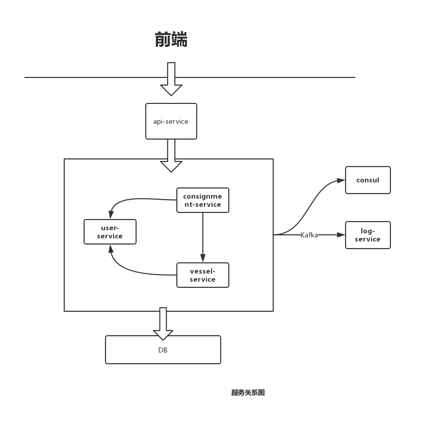
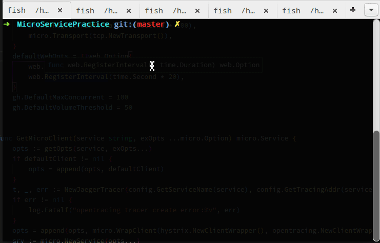
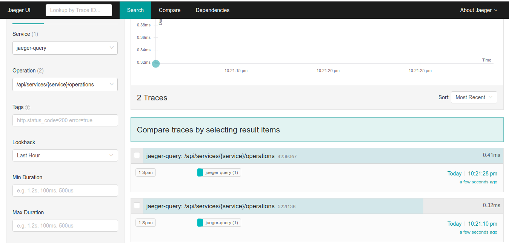

# Golang微服务开发实践

微服务概念学习：可参考 [Nginx 的微服务文章](https://www.nginx.com/blog/introduction-to-microservices/)

微服务最佳实践：可参考 [微服务最佳实践](https://juejin.im/post/5cbbe051f265da03973aabcb#heading-24)

## demo 简介

服务：

- consignment-service（货运服务）
- user-service（用户服务）
- log-service (日志服务)
- vessel-service（货船服务）
- api-service (API 服务)

用到的技术栈如下：

```yaml
framework: go-micro, gin
Transport: tcp
Server: rpc
Client: rpc
RegisterTTL: 30s
RegisterInterval: 20s
Registry: consul, 服务发现和注册
Broker: kafka, 消息队列
Selector: cache, 负载均衡
Codec: protobuf, 编码
Tracing: jaeger, 链路追踪
Metrics: jaeger
breaker: hystrix, 熔断
ratelimit: uber/ratelimit, 限流
```

### 服务关系图



### 实体关系图


### 服务流程示例


### 认证

采用 JWT


### 发布订阅模式


### demo 运行

前提工具：`go, dep, docker, docker-compose, mongo`

首先初始化：`make init`  

**Makefile** 部分代码如下：

```makefile
init:
    cd ..
	mv MicroServicePractice ${GOPATH}/src/Ethan/
	./pull.sh # 安装 go 依赖
	cd plugins
	docker-compose -f docker-compose.yml up -d # 安装插件，如：kafka, consul, zookeeper, jaeger
```

之后就可以运行代码了：

注：建议自己开多个终端 `go run` ，这样可以看日志

```shell
make run # 允许 服务 server
```

测试：

注：注意顺序，刚开始啥数据都没有的

```shell
go run user-cli/cli.go
export Token=$Token # 注意换成前面生成的Token
go run vessel-cli/cli.go
go run consignment-cli/cli.go
```







## 开发详解

### proto 代码生成

安装工具：

*protoc* 安装：http://google.github.io/proto-lens/installing-protoc.html

*protoc-gen-go* 和 *protoc-gen-micro*

```shell
go get -u -v google.golang.org/grpc				
go get -u -v github.com/golang/protobuf/protoc-gen-go
go get -u -v github.com/micro/protoc-gen-micro
```

生成的脚本我已经写好 *Makefile*, 进入 *interface-center* 目录，执行`make build` 即可

内部示例如下：

```shell
protoc --proto_path=proto:. --go_out=plugins=micro:out/ proto/vessel/vessel.proto
```

这里使用 micro 插件，若想和不使用插件对比，可使用如下命令：

```shell
protoc --proto_path=proto:. --go_out=out/ --micro_out=out/ proto/vessel/vessel.proto
```

这样会生成两个文件，一个为 *.micro.go* 一个为 *.pb.go*

这里顺便看一下 生成的 pb 文件里是如何进行 rpc 调用的，我们随便看一个 方法，如：*vessel* 的 *FindAvailable*

```go
func (c *vesselServiceClient) FindAvailable(ctx context.Context, in *Specification, opts ...client.CallOption) (*Response, error) {
	req := c.c.NewRequest(c.serviceName, "VesselService.FindAvailable", in)
	out := new(Response)
	err := c.c.Call(ctx, req, out, opts...)
	if err != nil {
		return nil, err
	}
	return out, nil
}
```
```
func newRequest(service, endpoint string, request interface{}, contentType string, reqOpts ...RequestOption) Request {
    var opts RequestOptions

    for _, o := range reqOpts {
        o(&opts)
    }

    // set the content-type specified
    if len(opts.ContentType) > 0 {
        contentType = opts.ContentType
    }

    return &rpcRequest{
        service:     service,
        method:      endpoint,
        endpoint:    endpoint,
        body:        request,
        contentType: contentType,
        opts:        opts,
    }
}
```

### 微服务开发流程

如果使用 *grpc* 作为 *server* 和 *client*，开发流程如下：

注：*server* 和 *client* 必须相同，如：我的代码中 *server* 和 *client* 使用的都是 *rpc*, *transport* 是 *tcp* 


### 目录简介

- api：对外暴露的HTTP web 接口，可以理解为 网关
- common：所有服务都能调用的东西，如 *GetMicroClient, GetMicroServer* 
- config：配置中心，其他服务的启动都依赖的配置
- consignment
- consignment-cli：cli 测试
- interface-center：proto 文件中心，同时生成的 .go 文件也在这里
- shippy-ui：前端测试 ui 代码，对接API，API还没写完
- user
- user-cli
- vessel
- vessel-cli


### 初始化

示例代码：consignment/main.go, common/service.go

```go
// 直接调用自己写的公有的库获取 server，保持配置同步	
// common.AuthWrapper 为前置认证，采用JWT
srv := common.GetMicroServer(service, micro.WrapHandler(common.AuthWrapper))
```

common.GetMicroServer

```go
func GetMicroServer(service string, exOpts ...micro.Option) micro.Service {
	opts := getOpts(service)
	if defaultServer != nil {
		opts = append(opts, defaultServer)
	}
	// ...
    
    // 注意顺序，同样的配置后面的会将前面的覆盖
	opts = append(opts, exOpts...)

	srv := micro.NewService(opts...)
	// 初始化，解析命令行参数
	srv.Init()
	return srv
}
```

注：调用者的 client, transport 应当和 server 的 client, transport 配置相同，所以开发 micro web的时候要注意！micro web 全是 HTTP 或者 ws，需要自己使用和后面服务相同的 client 来完成转发。


### 服务注册

这里我的demo中采用了 consul，consul 自带了 UI和健康检查，consul UI 端口为：8500

```go
// 注册延迟，30s 内没有注册则失效，consul 会自动删除服务
        micro.RegisterTTL(time.Second * 30),
// 注册间隔，每隔 20s 注册一次
		micro.RegisterInterval(time.Second * 20)
// ...
// opts 中添加如下配置即可
micro.Registry(consul.NewRegistry(func(op *registry.Options) {
			op.Addrs = config.GetRegistryAddrs(service)
		}))
```

docker-compose.yml 中已经定义，这里测试用，因此只采用单节点(server)的形式，consul 采用 Raft 算法，为了保证选主无误，节点(server)数必须是奇数，*bootstrap-expect* 表示节点数量

```yaml
  consul:
    image: consul:1.5
    container_name: consul-node1
    command: agent -server -bootstrap-expect=1 -node=node1 -bind=0.0.0.0 -client=0.0.0.0 -datacenter=dc1
    volumes:
      - ./consul/node1:/consul/data

  consul-client:
    image: consul:1.5
    container_name: consul-client1
    command: agent -retry-join=consul -node=client1 -bind=0.0.0.0 -client=0.0.0.0 -datacenter=dc1 -ui
    ports:
      - "8500:8500"
      - "8600:8600"
      - "8300:8300"
    depends_on:
      - consul
    volumes:
      - ./consul/client1:/consul/data
```

### watch

```go
	// 这里的 handler 应当实现 pb 中定义的调用
    h := handler.GetHandler(session, vClient, uClient, bk)	
    // 将 server 作为微服务的服务端
	pb.RegisterShippingServiceHandler(srv.Server(), h)

	if err := srv.Run(); err != nil {
		log.Fatalf("failed to serve: %v", err)
	}
```

pb

```protobuf
// 货轮微服务
service ShippingService {
    // 托运一批货物
    rpc CreateConsignment (Consignment) returns (Response) {
    }
    // 查看托运货物的信息
    rpc GetConsignments (GetRequest) returns (Response) {
    }
}
```

handler

```go
func (h *Handler) CreateConsignment(ctx context.Context, req *pb.Consignment, resp *pb.Response) error {
}
func (h *Handler) GetConsignments(ctx context.Context, req *pb.GetRequest, resp *pb.Response) error {
}
```

### 上下文 context

在我们的 AuthWrapper 中，ctx 作为上下文信息传递的方式，可在 ctx 中添加信息

```go
//
//  AuthWrapper 是一个高阶函数，入参是 "下一步" 函数，出参是认证函数
// 在返回的函数内部处理完认证逻辑后，再手动调用 fn() 进行下一步处理
// token 是从 上下文中取出的，再调用 user-service 将其做验证
// 认证通过则 fn() 继续执行，否则报错
//
func AuthWrapper(fn server.HandlerFunc) server.HandlerFunc {
	log.Println("AuthWrapper")
	return func(ctx context.Context, req server.Request, resp interface{}) error {
		// consignment-service 独立测试时不进行认证
		if os.Getenv("DISABLE_AUTH") == "true" {
			return fn(ctx, req, resp)
		}
		meta, ok := metadata.FromContext(ctx)
		if !ok {
			return errors.New("no auth meta-data found in request")
		}

		token := meta["token"]

		// Auth here
		authResp, err := GetUserClient().ValidateToken(context.Background(), &userPb.Token{
			Token: token,
		})

		log.Println("Auth Resp:", authResp)
		if err != nil {
			return err
		}
        // 这里将 JWT 解析出来的 user_id 传递下去
		ctx = context.WithValue(ctx, "user_id", authResp.UserId)
		err = fn(ctx, req, resp)
		return err
	}
}

```

### handler

在所有前置操作执行完毕之后，开始执行 handler 真正的 Call，handler 的函数定义必须和 pb 中一模一样。

处理完之后直接编辑 resp 即可，之后返回 nil，resp 是一个指针，直接传递了返回信息。

```go
func (h *Handler) CreateConsignment(ctx context.Context, req *pb.Consignment, resp *pb.Response) error {
    // ... 处理
	resp.Created = true
	resp.Consignment = req

    // 后置操作
	go func() {
		// ...
		h.pubLog(userID, "CreateConsignment", msg)
	}()
	return nil
}
```

### 过滤器

这里以版本过滤器为例：

```go
// Filter will filter the version of the service
func Filter(v string) client.CallOption {
	if v == "" {
		v = "latest"
	}
	filter := func(services []*registry.Service) []*registry.Service {
		var filtered []*registry.Service

		for _, service := range services {
			if service.Version == v {
				filtered = append(filtered, service)
			}
		}

		return filtered
	}

	return client.WithSelectOption(selector.WithFilter(filter))
}

```

之后在进行 client.Call 的时候可以使用

```go
vResp, err := h.vesselClient.FindAvailable(ctx, vReq, common.Filter(version))
```

### db 交互

一般而言不要把 pb 结构体直接插入 数据库中，最好有一个 中间转换层。示例如下：

```go
func (repo *ConsignmentRepository) Create(con *pb.Consignment) error {
    // 这里将PB转换为想要的结构体，之后再插入
	data := PBConsignment2Consignment(con)
    // dao 层直接对接DB操作
	return dao.Insert(repo.collection(), &data)
}

// 在外面记得把 Session Close
```

### broker

消息队列

```go
// common/service.go/GetMicroServer()
// 注册
    brokerKafka := kafka.NewBroker(func(options *broker.Options) {
        // eg: []{"127.0.0.1:9092"}
		options.Addrs = config.GetBrokerAddrs(service)
	})
	if err := brokerKafka.Connect(); err != nil {
		log.Fatalf("Broker Connect error: %v", err)
	}
// ... micro.Broker(brokerKafka)
```

注册完之后就开始定义 接口了

```go
	// 这里我将 kafka broker 传入 handler 中
    bk := srv.Server().Options().Broker
	h := handler.GetHandler(session, vClient, uClient, bk)
```

发布消息：

```go
// 发送log
   // ...
   data := &broker.Message{
      Header: map[string]string{
         "user_id": userID,
      },
      Body: body,
   }

   if err := h.Broker.Publish(topic, data); err != nil {
      log.Printf("[pub] failed: %v\n", err)
   }
```

订阅消息：

```go
	bk := srv.Server().Options().Broker
    // 这里订阅了 一个 topic, 并提供接口处理
	_, err := bk.Subscribe(topic, subLog)
```

```go
func subLog(pub broker.Publication) error {
	var logPB *pb.Log
    // 自行解析 body 即可
	if err := json.Unmarshal(pub.Message().Body, &logPB); err != nil {
		return err
	}
	log.Printf("[Log]: user_id: %s,  Msg: %v\n", pub.Message().Header["user_id"], logPB)
	return nil
}

```

### 熔断

Micro提供了两种实现，gobreaker和hystrix，熔断是在客户端实现。

来看看 hystrix：

```go
var (
    // DefaultTimeout is how long to wait for command to complete, in milliseconds
    DefaultTimeout = 1000
    // DefaultMaxConcurrent is how many commands of the same type can run at the same time
    DefaultMaxConcurrent = 10
    // DefaultVolumeThreshold is the minimum number of requests needed before a circuit can be tripped due to health
    DefaultVolumeThreshold = 20
    // DefaultSleepWindow is how long, in milliseconds, to wait after a circuit opens before testing for recovery
    DefaultSleepWindow = 5000
    // DefaultErrorPercentThreshold causes circuits to open once the rolling measure of errors exceeds this percent of requests
    DefaultErrorPercentThreshold = 50
    // DefaultLogger is the default logger that will be used in the Hystrix package. By default prints nothing.
    DefaultLogger = NoopLogger{}
)

type Settings struct {
    Timeout                time.Duration
    MaxConcurrentRequests  int
    RequestVolumeThreshold uint64
    SleepWindow            time.Duration
    ErrorPercentThreshold  int
}
```

若想修改参数，hystrix 没有提供全局的接口修改，这里我直接修改默认参数

```go
//  "github.com/afex/hystrix-go/hystrix"	
    hystrix.DefaultMaxConcurrent = 100
	hystrix.DefaultVolumeThreshold = 50
```

注册：

```go
// "github.com/micro/go-plugins/wrapper/breaker/hystrix"
// 添加如下配置即可
micro.WrapClient(hystrix.NewClientWrapper()
```

### 限流

*ratelimit* 可以在客户端做，也可以在服务端做；micro提供了两种方案：`juju/ratelimit`、`uber/ratelimit`。

我们看看 uber 的：

```go
// "github.com/micro/go-plugins/wrapper/ratelimiter/uber"
// 添加如下配置即可
// ratelimit 的配置可自行查看 API 修改
micro.WrapClient(ratelimit.NewHandlerWrapper(1024))
```

### 链路追踪

这里使用 *jaeger* , *jaeger* 提供了UI界面，端口为16686

docker-compose.yml 中已经定义

```yaml
  jaeger:
    image: jaegertracing/all-in-one:1.12
    container_name: tracing
    environment:
      COLLECTOR_ZIPKIN_HTTP_PORT: 9411
    ports:
      - "5775:5775/udp"
      - "6831:6831/udp"
      - "6832:6832/udp"
      - "5778:5778"
      - "16686:16686"
      - "14268:14268"
      - "9411:9411"
```

```go
func NewJaegerTracer(serviceName, addr string) (opentracing.Tracer, io.Closer, error) {
	// Sample configuration for testing. Use constant sampling to sample every trace
	// and enable LogSpan to log every span via configured Logger.
	cfg := jaegercfg.Configuration{
		Sampler: &jaegercfg.SamplerConfig{
			Type:  jaeger.SamplerTypeConst,
			Param: 1,
		},
		Reporter: &jaegercfg.ReporterConfig{
			LogSpans: true,
			BufferFlushInterval: 1 * time.Second,
		},
	}

	cfg.ServiceName = serviceName

	// Example logger and metrics factory. Use github.com/uber/jaeger-client-go/log
	// and github.com/uber/jaeger-lib/metrics respectively to bind to real logging and metrics
	// frameworks.
	jLogger := &jaegerLogger{}
	jMetricsFactory := metrics.NullFactory

	metricsFactory := metrics.NullFactory
	metrics := jaeger.NewMetrics(metricsFactory, nil)

	sender, err := jaeger.NewUDPTransport(addr, 0)
	if err != nil {
		log.Logf("could not initialize jaeger sender: %s", err.Error())
		return nil, nil, err
	}

	repoter := jaeger.NewRemoteReporter(sender, jaeger.ReporterOptions.Metrics(metrics))

	return cfg.NewTracer(
		jaegercfg.Logger(jLogger),
		jaegercfg.Metrics(jMetricsFactory),
		jaegercfg.Reporter(repoter),
	)

}

type jaegerLogger struct{}

func (l *jaegerLogger) Error(msg string) {
	log.Logf("ERROR: %s", msg)
}

// Infof logs a message at info priority
func (l *jaegerLogger) Infof(msg string, args ...interface{}) {
	log.Logf(msg, args...)
}
```

```go
// 	"github.com/micro/go-plugins/wrapper/trace/opentracing"
opentracing.NewClientWrapper(t)
```

### API

这里结合大名鼎鼎的 HTTP Restful 框架 **gin** 使用

主要代码如下：

```go
	// web 的初始化不太一样 micro -> web
    srv := common.GetMicroWeb(service)
    // ...
    router := gin.Default()
    // ... 正常 gin router 绑定操作
    // 最后直接将 服务 / 绑定到 gin 的router上，交给 gin 处理
	srv.Handle("/", router)
```

## go-micro 详解

*micro* 文档：https://micro.mu/docs/index.html

参见另一篇 [go-micro详解](https://github.com/yun-mu/MicroServicePractice/blob/master/go-micro%E8%AF%A6%E8%A7%A3.md)

## micro

参见另一篇 [micro 工具箱](https://github.com/yun-mu/MicroServicePractice/blob/master/Micro%E5%B7%A5%E5%85%B7%E7%AE%B1.md)