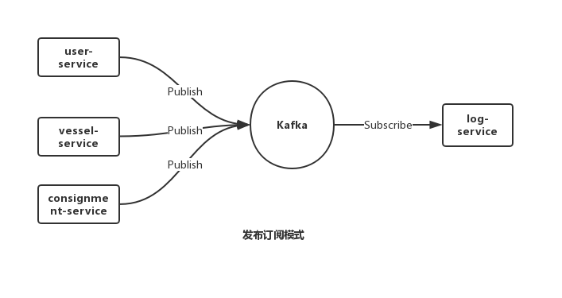

# Golang微服务开发实践

微服务概念学习：可参考 [Nginx 的微服务文章](https://www.nginx.com/blog/introduction-to-microservices/)

## demo 简介

服务：

- consignment-service（货运服务）
- user-service（用户服务）
- log-service (日志服务)
- vessel-service（货船服务）
- api-service (API 服务)

用到的技术栈如下：

```yaml
framework: go-micro, gin
Transport: tcp
Server: rpc
Client: rpc
RegisterTTL: 30s
RegisterInterval: 20s
Registry: consul, 服务发现和注册
Broker: kafka, 消息队列
Selector: cache, 负载均衡
Codec: protobuf, 编码
Tracing: jaeger, 链路追踪
Metrics: jaeger
breaker: hystrix, 熔断
ratelimit: uber/ratelimit, 限流
```

### 服务关系图


### 实体关系图


### 服务流程示例


### 认证

采用 JWT


### 发布订阅模式



微服务开发流程：


### demo 运行

前提工具：`go, dep, docker, docker-compose, mongo`

首先初始化：`make init`  注：建议阅读**Makefile**文件

之后就可以运行代码了：

注：建议自己开多个终端 `go run` ，这样可以看日志

```
make run
```

测试：

注：注意顺序，刚开始啥数据都没有的

```
go run user-cli/cli.go
export Token=$Token # 注意换成前面生成的Token
go run vessel-cli/cli.go
go run consignment-cli/cli.go
```

## 开发详解

学习代码：

https://github.com/hb-go/micro

https://github.com/Allenxuxu/microservices

https://github.com/wuYin/shippy

https://github.com/micro/examples

## go-micro 详解

参见另一篇 [go-micro详解](https://github.com/yun-mu/MicroServicePractice/blob/master/go-micro%E8%AF%A6%E8%A7%A3.md)

